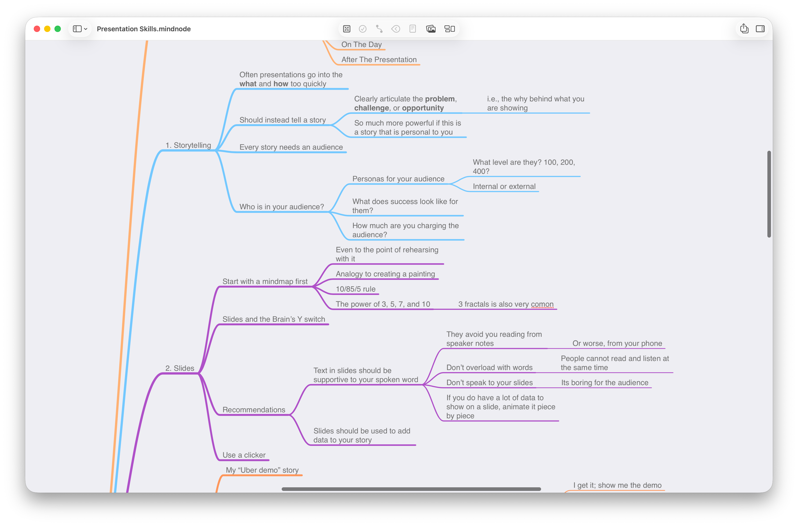

# "Your slides have really nice colors" {.justify background-image="backgrounds/paint.png" background-opacity="0.3"}

## Beyond Your Project Presentation {.blurred background-image="backgrounds/paint.png" background-opacity="0.3"}

- Pitching a VC for funding
- Speaking at a conference
- Teaching at DigiPen!

## What We Will Cover Today

- The importance of **Storytelling**
- Constructing **Slides**
- Nailing the **Demos**
- Being prepared **On The Day**
- Your Presentation **Takeaways**

# {.justify background-image="backgrounds/story.png" background-opacity="1.0"}

## The Importance of Storytelling {.darken .white .blurred background-image="backgrounds/story.png" background-opacity="0.9"}

- Many presentations get into the **what** and **how**, but miss the **why**
- Stories help frame the **why**
- Especially if that story has a personal connection

## The Importance of Storytelling {.darken .white .blurred background-image="backgrounds/story.png" background-opacity="0.9"}

- Why did you choose this project?
- What problem are you trying to solve for people?
- How much impact could this have?

# Every Story Needs An Audience

## Who Is Your Audience?

- What are the **personas** for your audience?
  - 100 level? 400 level?
  - Internal / External
- What does success look like for **them**?
- How much are you **costing** your audience?

# Slides

## Constructing Slides

- Don't start by opening PowerPoint!
- Instead, create a layout (mind map)

## Constructing Slides

{.lightbox fig-align="center" width="1000px"}

## Constructing Slides

- Mind map will help you:
  - Bring balance to your presentation (10/85/5)
  - Help you categorize (power of 3, 5, 7, and 10)
  - Enable you to rehearse before you have any slides!

# Your Slides

## Your Slides

- Text in slides should be supportive "cues" to your spoken word
- They avoid you having to read from your speaker notes
  - (or worse, your phone!)

# The Brain's Y Switch

## Brain's Y Switch

- Your audience is listening to you or they are reading your slide
- Few, if any, can do both

# TBD: Example wall of text slide

## Brain's Y Switch

- If you have a lot of text, introduce it gradually

# TBD: Example wall of text slide, animated

# Demos

## Where Is Your Demo?

- Get to your demo as soon as you can
- Too many "10 min presentation with 9 mins of slides and a 1 min rushed demo"
- Audience: "I get it. Now show me the demo."

## Live Demos

- Live demos are scary
- But they beat videos or screenshots **every time**

## Demo Script

- What needs to be reset/running at the start of your demo?
- Which windows needs to be open/closed?
- What are the steps?
  - Tip: Write large if you are typing code live

## Demo Gods

- "It worked just before class..."
  - Can't share my display on the projector
  - WiFi magically disappears or runs slow
  - That Windows update you've been postponing...

## Demo Gods

- What's your backup plan?
  - Pre-recorded video is a must
  - Backup screenshots in appendix
  - Know when to move on...

# The Big Day!

## Location

- Size of the room?
- AV needs?
  - Especially if you are playing audio
- If this is a new room, can you test/rehearse beforehand?

## Nerves

- They never go away
  - My "PDC Demo" story
- Rehearse, rehearse, rehearse
- Loosen up by speaking to the audience beforehand

## More Nerves

- Do you have water? 
  - Is it open? But not too much!
- Eye contact with the audience
  - Figure of 8
- Build off the prior presentation
  - "I can do better!"
  - "I can't let the audience down after that!"

## Humor

- Don't force-fit humor or jokes
  - Be yourself
- If you have jokes, rehearse the timing
  - And never mention politics or religion
- Never laugh at your own jokes

## Taking Questions

- During or wait until the end?
  - Redirect if running out of time
- Ack; Answer; Confirm
- It's OK not to know the answer
  - "I'm not sure on that, but I'll follow up with you"

# Have Fun!

## Presentation Take Aways

- What do you want to acheive **after** the presentation?
- Do you have the right CTAs (Call To Action) at the end?
  - e.g., Scan this QR code and download my app!

# TBD

# Conclusion

