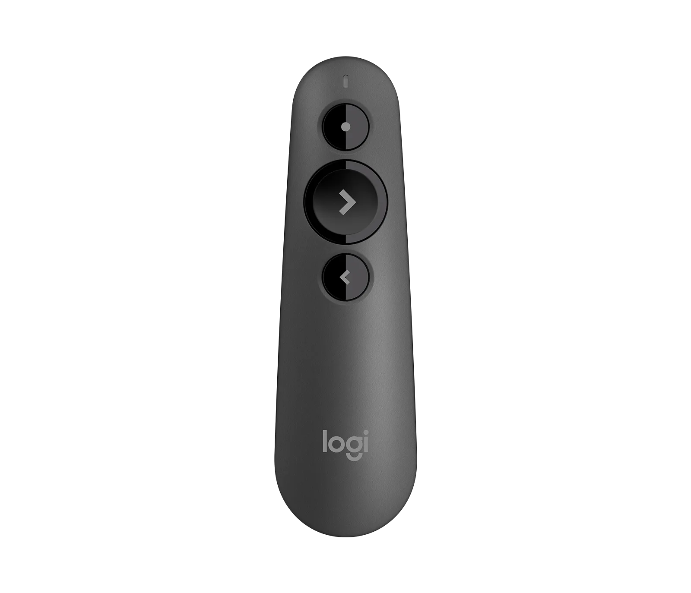

# "Your slides have really nice colors, Simon" {.justify background-image="backgrounds/paint.png" background-opacity="0.3"}

## Beyond This Semester {.blurred background-image="backgrounds/paint.png" background-opacity="0.3"}

- Pitching a VC for funding
- Speaking at a conference
- Teaching at DigiPen!

## What We Will Cover Today { .white background="linear-gradient(135deg, #0a0e1a 0%, #0d2137 60%, #1a1f35 100%)"}

- The importance of **Storytelling**
- Constructing **Slides**
- Nailing the **Demos**
- Being prepared **On The Day**
- Your Presentation **Takeaways**

# {.justify background-image="backgrounds/story.png" background-opacity="1.0"}

## The Importance of Storytelling {.darken .white .blurred background-image="backgrounds/story.png" background-opacity="0.9"}

- Many presentations get into the **what** and **how**, but miss the **why**
- Stories help frame the **why**
- Especially if that story has a personal connection

## The Importance of Storytelling {.darken .white .blurred background-image="backgrounds/story.png" background-opacity="0.9"}

- Why did you choose this project?
- What problem are you trying to solve for people?
- How much impact could this have?

# Every Story Needs An Audience {.darken .white .blurred background-image="backgrounds/audience.png" background-opacity="0.9"}

## Who Is Your Audience? {.darken .white .blurred background-image="backgrounds/audience.png" background-opacity="0.9"}

- Do you have **personas** for your audience?
  - 100 level? 400 level?
  - Internal? External?
- What does success look like for **them**?
- How much are you **costing** your audience?

# Presentation Flow {.red background-image="backgrounds/flow.png" background-opacity="0.5"}

## Presentation Flow {.blurred .red background-image="backgrounds/flow.png" background-opacity="0.5"}

- Don't start by opening PowerPoint!
- Create the flow of the presentation
- Mind Map can be a great tool

## Presentation Flow {.blurred .red background-image="backgrounds/flow.png" background-opacity="0.5"}

{.lightbox fig-align="center" width="1000px"}

## Presentation Flow {.blurred .red background-image="backgrounds/flow.png" background-opacity="0.5"}

- Mind map will help you:
  - Bring balance to your presentation (10/85/5)
  - Help you categorize (power of 3, 5, 7, and 10)
  - Enable you to rehearse before you have any slides!

# Your Slides {.red background-image="backgrounds/blankslide.png" background-opacity="0.3"}

## Your Slides {.blurred .red background-image="backgrounds/blankslide.png" background-opacity="0.3"}

- Text in slides should be supportive "cues"
- Trigger memory
- They avoid you having to read from your speaker notes
  - (or worse, your phone!)

## Brain's "Y Switch" {.blurred .red background-image="backgrounds/blankslide.png" background-opacity="0.3"}

- Listening to you vs. Reading your slide
- Few, if any, can do both
- (Even if they think they can)

## Our Game Engine Architecture {.nonincremental style="font-size: 0.6em"}

Our custom game engine is built on a multi-layered architecture that separates concerns across rendering, physics, audio, and input systems. The rendering pipeline uses OpenGL 4.6 with a deferred shading model, supporting up to 512 dynamic lights per scene through a clustered lighting approach. The physics engine integrates a rigid body solver with support for convex hull collision detection using the GJK algorithm, with a broadphase BVH tree for spatial partitioning. We implemented a custom entity-component system (ECS) using a sparse set architecture to maximize cache coherency, with archetypes stored in contiguous memory pools. 

The audio system leverages OpenAL Soft with a custom DSP chain for reverb, occlusion, and distance attenuation. Input is handled through a buffered event queue that abstracts platform-specific APIs (Win32, SDL2) behind a unified interface. Our asset pipeline runs as a separate tool that compiles raw assets (FBX, PNG, WAV) into a custom binary format for fast runtime loading. The scripting layer exposes engine functionality to Lua via a hand-written binding layer, allowing designers to author gameplay logic without recompiling. Networking uses a lockstep model with deterministic simulation and delta-compressed snapshots sent at 20Hz, with client-side prediction and server reconciliation to mask latency. Memory management is handled through a hierarchy of allocators: a stack allocator for per-frame data, a pool allocator for fixed-size objects, and a general-purpose heap for everything else.

## Brain's "Y Switch" {.blurred .red background-image="backgrounds/blankslide.png" background-opacity="0.3"}

- If you have a lot of text...
  - Delete (and delete again)
  - Compress (and compress again)
  - Talk through "on click"

## Brain's "Y Switch" {.blurred .red background-image="backgrounds/blankslide.png" background-opacity="0.3"}

{.lightbox fig-align="center" width="500px"}

# {background-image="backgrounds/demo.png" background-opacity="0.9"}

## Your Demo {.white .blurred .darken background-image="backgrounds/demo.png" background-opacity="0.9"}

- Get to your demo as soon as you can
- "10 min presentation with 9 mins of slides and a 1 min rushed demo"
- Tipping Point: "I get it. Now show me the demo."

## Live Demos {.white .blurred .darken background-image="backgrounds/demo.png" background-opacity="0.9"}

- Live demos are scary
- But they beat videos or screenshots **every time**
- Live demos provide **authenticity**

## Demo Gods {.white .blurred .darken background-image="backgrounds/demo.png" background-opacity="0.9"}

- "It worked just before class..."
  - Can't share my display on the projector
  - WiFi magically disappears or runs slow
  - That Windows update you've been postponing...

## Demo Script {.white .blurred .darken background-image="backgrounds/demo.png" background-opacity="0.9"}

- What needs to be reset/running at the start of your demo?
- Which windows needs to be open/closed?
- What are the steps?
  - Tip: Write large if you are typing code live

## Demo Backup {.white .blurred .darken background-image="backgrounds/demo.png" background-opacity="0.9"}

- What's your backup plan?
  - Pre-recorded video is a must
  - Backup screenshots in appendix
  - Know when to move on...

# On The Day {.white background-image="backgrounds/mic.png" background-opacity="0.9"}

## Location {.white .blurred .darken background-image="backgrounds/mic.png" background-opacity="0.9"}

- Size of the room?
- AV needs?
  - Especially if you are playing audio
- New room? 
  - Can you test/rehearse beforehand?

## Nerves {.white .blurred .darken background-image="backgrounds/mic.png" background-opacity="0.9"}

- They never go away
  - My "PDC Demo" story
- Rehearse, rehearse, rehearse
- Loosen up by speaking to the audience beforehand

## More Nerves {.white .blurred .darken background-image="backgrounds/mic.png" background-opacity="0.9"}

- Do you have water? 
  - Is it open? But not too much!
- Eye contact with the audience
  - Figure of 8
- Energy from the prior presentation
  - "I can do better!"
  - "I can't let the audience down after that!"

## Humor {.white .blurred .darken background-image="backgrounds/mic.png" background-opacity="0.9"}

- Don't force-fit humor or jokes
  - Be yourself
- If you have jokes, rehearse the timing
  - And never mention politics or religion
- Never laugh at your own jokes

## Taking Questions {.white .blurred .darken background-image="backgrounds/mic.png" background-opacity="0.9"}

- During? Or wait until the end?
  - Redirect if running out of time
- Ack; Answer; Confirm
- It's OK not to know the answer
  - "I'm not sure on that, but I'll follow up with you"

# Enjoy It! {.white .blurred .darken background-image="backgrounds/mic.png" background-opacity="0.9"}

# {background-image="backgrounds/theend.png" background-opacity="0.9"}

## How To End {.blurred background-image="backgrounds/theend.png" background-opacity="0.2"}

- Endings can be abrupt
- Short conclusion of what you covered
- Takeaways for the audience

## Presentation Takeaways {.blurred background-image="backgrounds/theend.png" background-opacity="0.2"}

- CTAs (Calls To Action)
  - Download my game!
  - Checkout my GitHub Repo
  - Complete my survey
- Are you going to share your slides?
- How to contact you

## To Conclude { .white background="linear-gradient(135deg, #0a0e1a 0%, #0d2137 60%, #1a1f35 100%)"}

- The importance of **Storytelling**
- Constructing **Slides**
- Nailing the **Demos**
- Being prepared **On The Day**
- Your Presentation **Takeaways**

## To Conclude { .white background="linear-gradient(135deg, #0a0e1a 0%, #0d2137 60%, #1a1f35 100%)"}

- TBD

# Questions? { .white background="linear-gradient(135deg, #0a0e1a 0%, #0d2137 60%, #1a1f35 100%)"}

